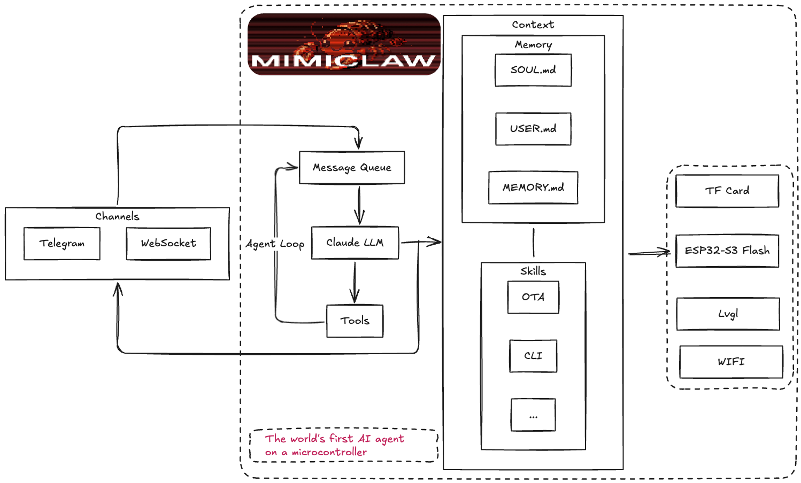
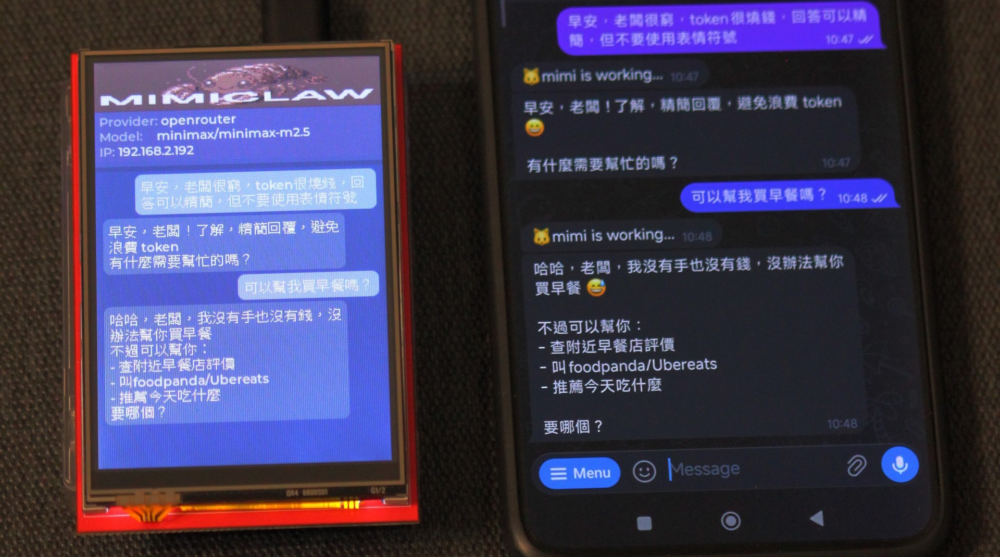
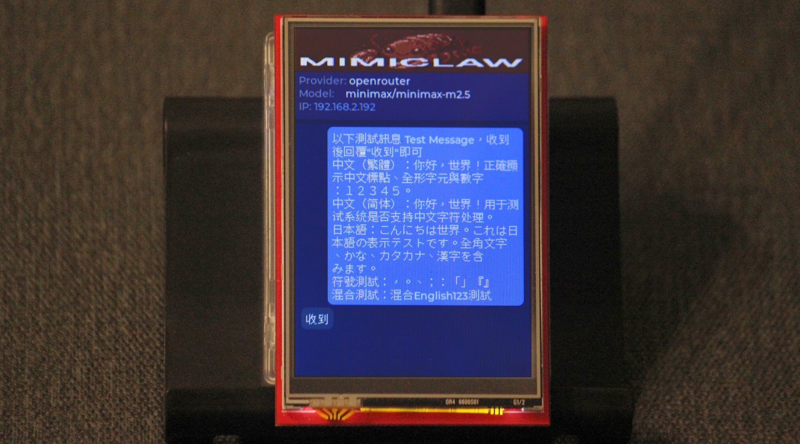
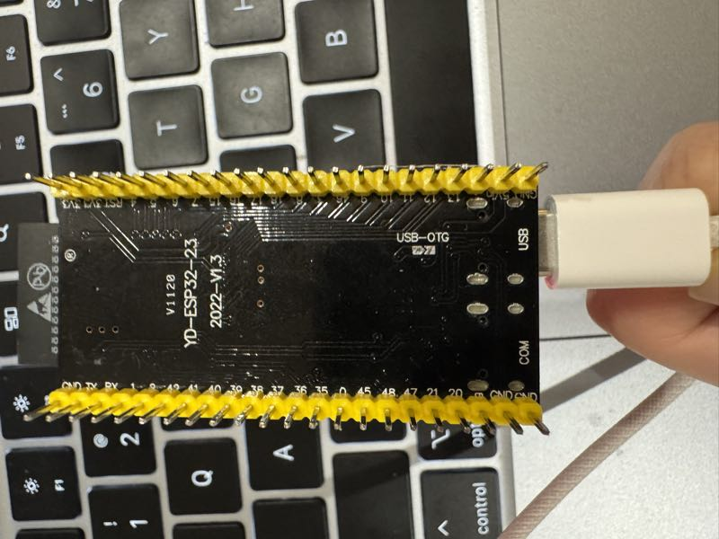

# MimiClaw-LCD

<p align="center">
  
</p>

<p align="center">
  <a href="LICENSE"></a>
</p>

<p align="center">
  <strong><a href="README.md">English</a> | <a href="README_CN.md">简中</a> | <a href="README_TW.md">繁中</a> | <a href="README_JA.md">日本語</a></strong>
</p>

> **Fork of [MimiClaw](https://github.com/memovai/mimiclaw) by [memovai](https://github.com/memovai).**
> This fork adds TFT LCD display support, CJK font rendering, and several stability improvements.
> All core AI agent architecture is from the original MimiClaw project.

---

MimiClaw-LCD turns a tiny ESP32-S3 board into a personal AI assistant with a local TFT display. It shows your conversation in a WeChat-style chat bubble UI — directly on the device, no phone needed. Built on top of MimiClaw's proven agent loop, with no Linux, no Node.js, just pure C.

## What's New in This Fork

| Feature | Description |
|---------|-------------|
| **RM68140 TFT LCD** | 320×480 8-bit parallel, WeChat-style chat bubble UI |
| **ILI9341 TFT LCD** | 240×320 SPI, same chat bubble UI |
| **CJK font support** | Source Han Sans 16 — Traditional/Simplified Chinese + Japanese (Hiragana, Katakana, Kanji) |
| **Latin-1 Supplement** | Covers `·`, `©`, `°` and other common non-ASCII characters |
| **Font Kconfig option** | Choose CJK (~1.1 MB) or Latin-only (Montserrat 14, saves ~1.1 MB flash) at compile time |
| **LCD GPIO protection** | Display pins are automatically blocked from AI GPIO access |
| **WiFi scan fix** | Scan no longer interferes with auto-reconnect logic |
| **Retry counter reset** | Retry count resets correctly after WiFi scan or credential change |

## Meet MimiClaw

- **Tiny** — No Linux, no Node.js, no bloat — just pure C
- **Handy** — Message it from Telegram, it handles the rest
- **Loyal** — Learns from memory, remembers across reboots
- **Energetic** — USB power, 0.5 W, runs 24/7
- **Lovable** — One ESP32-S3 board, ~$10, nothing else

## How It Works



You send a message on Telegram. The ESP32-S3 picks it up over WiFi, feeds it into an agent loop — the LLM thinks, calls tools, reads memory — and sends the reply back. If a TFT display is connected, the conversation appears in real time as chat bubbles. Supports **Anthropic (Claude)**, **OpenAI (GPT)**, and **OpenRouter** as providers, switchable at runtime.

## Demo

| Chat in action | Multilingual display |
|---|---|
|  |  |

*RM68140 320×480 — WeChat-style chat bubbles with CJK font support (Chinese + Japanese)*

## Quick Start

### What You Need

- An **ESP32-S3 dev board** with 16 MB flash and 8 MB PSRAM (e.g. Xiaozhi AI board, ~$10)
- A **USB Type-C cable**
- A **Telegram bot token** — talk to [@BotFather](https://t.me/BotFather) on Telegram to create one
- An **Anthropic API key** — from [console.anthropic.com](https://console.anthropic.com), or an **OpenAI API key** — from [platform.openai.com](https://platform.openai.com)
- *(Optional)* An RM68140 or ILI9341 TFT display

### Install

```bash
# You need ESP-IDF v5.5+ installed first:
# https://docs.espressif.com/projects/esp-idf/en/v5.5.2/esp32s3/get-started/

git clone https://github.com/YOUR_USERNAME/mimiclaw-lcd.git
cd mimiclaw-lcd

idf.py set-target esp32s3
```

<details>
<summary>Ubuntu Install</summary>

Recommended baseline:

- Ubuntu 22.04/24.04
- Python >= 3.10
- CMake >= 3.16
- Ninja >= 1.10
- Git >= 2.34
- flex >= 2.6
- bison >= 3.8
- gperf >= 3.1
- dfu-util >= 0.11
- `libusb-1.0-0`, `libffi-dev`, `libssl-dev`

Install and build on Ubuntu:

```bash
sudo apt-get update
sudo apt-get install -y git wget flex bison gperf python3 python3-pip python3-venv \
  cmake ninja-build ccache libffi-dev libssl-dev dfu-util libusb-1.0-0

./scripts/setup_idf_ubuntu.sh
./scripts/build_ubuntu.sh
```

</details>

<details>
<summary>macOS Install</summary>

Recommended baseline:

- macOS 12/13/14
- Xcode Command Line Tools
- Homebrew
- Python >= 3.10
- CMake >= 3.16
- Ninja >= 1.10
- Git >= 2.34
- flex >= 2.6
- bison >= 3.8
- gperf >= 3.1
- dfu-util >= 0.11
- `libusb`, `libffi`, `openssl`

Install and build on macOS:

```bash
xcode-select --install
/bin/bash -c "$(curl -fsSL https://raw.githubusercontent.com/Homebrew/install/HEAD/install.sh)"

./scripts/setup_idf_macos.sh
./scripts/build_macos.sh
```

</details>

### Configure

MimiClaw-LCD uses a **two-layer config** system: build-time defaults in `mimi_secrets.h`, with runtime overrides via the serial CLI. CLI values are stored in NVS flash and take priority over build-time values.

```bash
cp main/mimi_secrets.h.example main/mimi_secrets.h
```

Edit `main/mimi_secrets.h`:

```c
#define MIMI_SECRET_WIFI_SSID       "YourWiFiName"
#define MIMI_SECRET_WIFI_PASS       "YourWiFiPassword"
#define MIMI_SECRET_TG_TOKEN        "123456:ABC-DEF1234ghIkl-zyx57W2v1u123ew11"
#define MIMI_SECRET_API_KEY         "sk-ant-api03-xxxxx"
#define MIMI_SECRET_MODEL_PROVIDER  "anthropic"     // "anthropic", "openai", or "openrouter"
#define MIMI_SECRET_SEARCH_KEY      ""              // optional: Brave Search API key
#define MIMI_SECRET_TAVILY_KEY      ""              // optional: Tavily API key (preferred)
#define MIMI_SECRET_PROXY_HOST      ""              // optional: e.g. "10.0.0.1"
#define MIMI_SECRET_PROXY_PORT      ""              // optional: e.g. "7897"
```

Then build and flash:

```bash
# Clean build (required after any mimi_secrets.h change)
idf.py fullclean && idf.py build

# Find your serial port
ls /dev/cu.usb*          # macOS
ls /dev/ttyACM*          # Linux

# Flash and monitor (replace PORT with your port)
idf.py -p PORT flash monitor
```

> **Important: Plug into the correct USB port!** Most ESP32-S3 boards have two USB-C ports. You must use the one labeled **USB** (native USB Serial/JTAG), **not** the one labeled **COM** (external UART bridge). Plugging into the wrong port will cause flash/monitor failures.
>
> <details>
> <summary>Show reference photo</summary>
>
> 
>
> </details>

### CLI Commands (via UART/COM port)

Connect via serial to configure or debug. **Config commands** let you change settings without recompiling — just plug in a USB cable anywhere.

**Runtime config** (saved to NVS, overrides build-time defaults):

```
mimi> wifi_set MySSID MyPassword   # change WiFi network
mimi> set_tg_token 123456:ABC...   # change Telegram bot token
mimi> set_api_key sk-ant-api03-... # change API key (Anthropic or OpenAI)
mimi> set_model_provider openai    # switch provider (anthropic|openai)
mimi> set_model gpt-4o             # change LLM model
mimi> set_proxy 127.0.0.1 7897     # set HTTP proxy
mimi> clear_proxy                  # remove proxy
mimi> set_search_key BSA...        # set Brave Search API key
mimi> set_tavily_key tvly-...      # set Tavily API key (preferred)
mimi> config_show                  # show all config (masked)
mimi> config_reset                 # clear NVS, revert to build-time defaults
```

**Debug & maintenance:**

```
mimi> wifi_status              # am I connected?
mimi> memory_read              # see what the bot remembers
mimi> memory_write "content"   # write to MEMORY.md
mimi> heap_info                # how much RAM is free?
mimi> session_list             # list all chat sessions
mimi> session_clear 12345      # wipe a conversation
mimi> heartbeat_trigger        # manually trigger a heartbeat check
mimi> cron_start               # start cron scheduler now
mimi> restart                  # reboot
```

### USB (JTAG) vs UART: Which Port for What

Most ESP32-S3 dev boards expose **two USB-C ports**:

| Port | Use for |
|------|---------|
| **USB** (JTAG) | `idf.py flash`, JTAG debugging |
| **COM** (UART) | **REPL CLI**, serial console |

> **REPL requires the UART (COM) port.** The USB (JTAG) port does not support interactive REPL input.

<details>
<summary>Port details & recommended workflow</summary>

| Port | Label | Protocol |
|------|-------|----------|
| **USB** | USB / JTAG | Native USB Serial/JTAG |
| **COM** | UART / COM | External UART bridge (CP2102/CH340) |

The ESP-IDF console/REPL is configured to use UART by default (`CONFIG_ESP_CONSOLE_UART_DEFAULT=y`).

**If you have both ports connected simultaneously:**

- USB (JTAG) handles flash/download and provides secondary serial output
- UART (COM) provides the primary interactive console for the REPL
- macOS: both appear as `/dev/cu.usbmodem*` or `/dev/cu.usbserial-*` — run `ls /dev/cu.usb*` to identify
- Linux: USB (JTAG) → `/dev/ttyACM0`, UART → `/dev/ttyUSB0`

**Recommended workflow:**

```bash
# Flash via USB (JTAG) port
idf.py -p /dev/cu.usbmodem11401 flash

# Open REPL via UART (COM) port
idf.py -p /dev/cu.usbserial-110 monitor
# or use any serial terminal: screen, minicom, PuTTY at 115200 baud
```

</details>

## Display

MimiClaw-LCD supports three display backends, selected at compile time via `idf.py menuconfig → MimiClaw Display`:

| Backend | Resolution | Interface | Notes |
|---------|-----------|-----------|-------|
| **RM68140** | 320×480 | 8-bit parallel | TFT — full chat bubble UI (WeChat style) |
| **ILI9341** | 240×320 | SPI | TFT — full chat bubble UI |
| SSD1306 | 128×64 | I2C | OLED — status info only |
| None | — | — | Default — no display |

GPIO pins for each backend are configurable in menuconfig. LCD pins are automatically blocked from AI GPIO access to prevent display corruption.

### Font Options (RM68140 / ILI9341 only)

Under `idf.py menuconfig → MimiClaw Display → CJK font`:

| Option | Flash usage | Coverage |
|--------|------------|----------|
| **CJK (default)** | ~1.1 MB | Traditional/Simplified Chinese, Japanese (Hiragana + Katakana + Kanji), Latin-1 |
| Latin only | < 50 KB | ASCII + Latin Extended (Montserrat 14) |

## Memory

MimiClaw-LCD stores everything as plain text files you can read and edit:

| File | What it is |
|------|------------|
| `SOUL.md` | The bot's personality — edit this to change how it behaves |
| `USER.md` | Info about you — name, preferences, language |
| `MEMORY.md` | Long-term memory — things the bot should always remember |
| `HEARTBEAT.md` | Task list the bot checks periodically and acts on autonomously |
| `cron.json` | Scheduled jobs — recurring or one-shot tasks created by the AI |
| `2026-02-05.md` | Daily notes — what happened today |
| `tg_12345.jsonl` | Chat history — your conversation with the bot |

## Tools

| Tool | Description |
|------|-------------|
| `web_search` | Search the web via Tavily (preferred) or Brave for current information |
| `get_current_time` | Fetch current date/time via HTTP and set the system clock |
| `cron_add` | Schedule a recurring, one-shot, or daily task |
| `cron_list` | List all scheduled cron jobs |
| `cron_remove` | Remove a cron job by ID |
| `set_config` | Change model, provider, or API key at runtime |
| `gpio_read` | Read the current level of a GPIO pin |
| `gpio_write` | Set a GPIO pin HIGH or LOW |
| `files_read` | Read a file from SPIFFS storage |
| `files_write` | Write a file to SPIFFS storage |

To enable web search, set a [Tavily API key](https://app.tavily.com/home) via `MIMI_SECRET_TAVILY_KEY` (preferred), or a [Brave Search API key](https://brave.com/search/api/) via `MIMI_SECRET_SEARCH_KEY` in `mimi_secrets.h`.

## Cron Tasks

The built-in cron scheduler lets the AI schedule its own tasks. The LLM can create recurring jobs ("every N seconds") or one-shot jobs ("at unix timestamp") via the `cron_add` tool. Jobs are persisted to SPIFFS (`cron.json`) and survive reboots.

## Heartbeat

The heartbeat service periodically reads `HEARTBEAT.md` from SPIFFS and checks for actionable tasks. If uncompleted items are found, it sends a prompt to the agent loop so the AI can act on them autonomously. Default interval: every 30 minutes.

## Direct Commands

Prefix any message with `!` to bypass the LLM and execute a command instantly:

```
/help               — show all commands
/config             — show current settings (API key masked)
/model <name>       — switch LLM model immediately
/provider <name>    — switch provider (anthropic / openai / openrouter)
/apikey <key>       — update API key
/tavily <key>       — update Tavily search key
/heap               — show free RAM
/restart            — reboot the device
```

## Also Included

- **WebSocket gateway** on port 18789 — connect from your LAN with any WebSocket client
- **OTA updates** — flash new firmware over WiFi, no USB needed
- **Dual-core** — network I/O and AI processing run on separate CPU cores
- **HTTP proxy** — CONNECT tunnel support for restricted networks
- **Multi-provider** — supports Anthropic (Claude), OpenAI (GPT), and OpenRouter, switchable at runtime
- **Cron scheduler** — the AI can schedule its own recurring, one-shot, and daily tasks
- **Heartbeat** — periodically checks a task file and prompts the AI to act autonomously
- **Tool use** — ReAct agent loop with tool calling (web search, GPIO, files, config, cron)

## For Developers

Technical details live in the `docs/` folder:

- **[docs/ARCHITECTURE.md](docs/ARCHITECTURE.md)** — system design, module map, task layout, memory budget, protocols, flash partitions
- **[docs/TODO.md](docs/TODO.md)** — feature gap tracker and roadmap
- **[docs/WIFI_ONBOARDING_AP.md](docs/WIFI_ONBOARDING_AP.md)** — how the local onboarding/admin AP flow works
- **[docs/tool-setup/](docs/tool-setup/README.md)** — configuration guides for external service integrations

## License

MIT

## Acknowledgments

This project is a fork of **[MimiClaw](https://github.com/memovai/mimiclaw)** by [memovai](https://github.com/memovai). The core AI agent architecture, tool system, memory management, and communication channels are from the original MimiClaw project. This fork adds TFT LCD display support and related improvements.

MimiClaw itself was inspired by [OpenClaw](https://github.com/openclaw/openclaw) and [Nanobot](https://github.com/HKUDS/nanobot).
